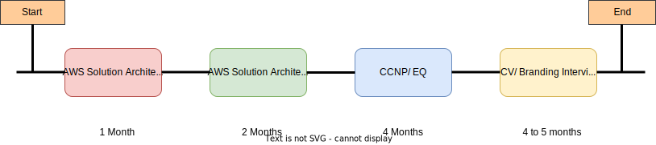

### Hi there 👋

- 🔭 I’m currently working on Web application development using frameworks like Angular, React and api's using spring boot, nodejs etc..
- 🤔 I’m looking for help with https://gisgurus.web.app/spatial-toolkit feature development 
- 💬 Ask me about web application development, mapping, system design etc.
- 🌱 I’m currently practicing cloud architect skills
- 📫 How to reach me: you can find me on Twitter/LinkedIn/Github @ravioshankar    

<!--  -->

<!--
**ravioshankar/ravioshankar** is a ✨ _special_ ✨ repository because its `README.md` (this file) appears on your GitHub profile.

Here are some ideas to get you started:

- 🔭 I’m currently working on ...
- 🌱 I’m currently learning ...
- 👯 I’m looking to collaborate on ...
- 🤔 I’m looking for help with ...
- 💬 Ask me about ...
- 📫 How to reach me: ...
- 😄 Pronouns: ...
- ⚡ Fun fact: ...
-->
